# Pou - Point of You

this is my capstopne project from my 3-month long coding bootcamp at Neue Fische.
The app is some kind of socialized location discovery platform. Once the user has created an account he or she will be able to create posts about the places he or she visited and the others are able to visit the respective location via the post. Let's say you are in a bar and want to make a post. Once you fire up the app it detects via GPS where you are and creates a map with a marker. You just take a picture, write a caption and post it. Your post then appears on the feed of others and when they click on the post it redirects them to a detailed view of it where they can press a button called lead me to point. Once pressed the app calculates a route between the point of your post and the point where that user is and gives him directions to visit the same place as you did. PoU is short for "Point of You" which is a word play on point of view.

## Getting started

1. Clone or Fork the project
2. Run npm i and wait for the dependencies to install
3. Run npm run api, npm run tunnel and npm start in this specific order to start the project.

## Assets that are not within the repository

1. [UI Design](https://www.figma.com/file/o0idcfrOpHEroulkC4NVQd/POU-UI?node-id=0%3A1)

## Screenshots

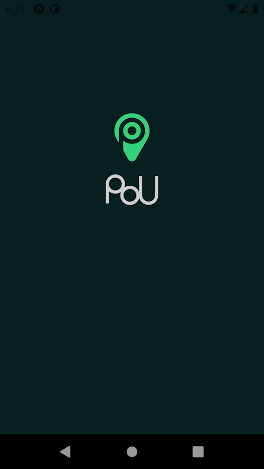
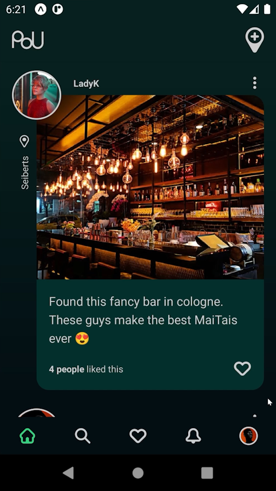
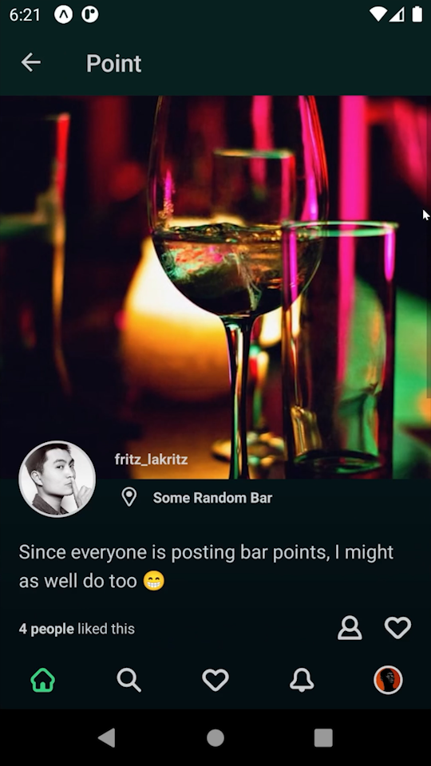
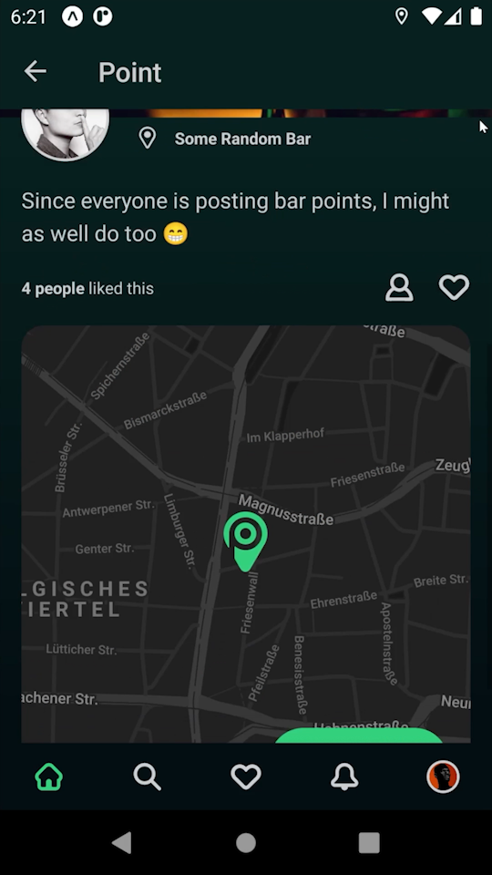
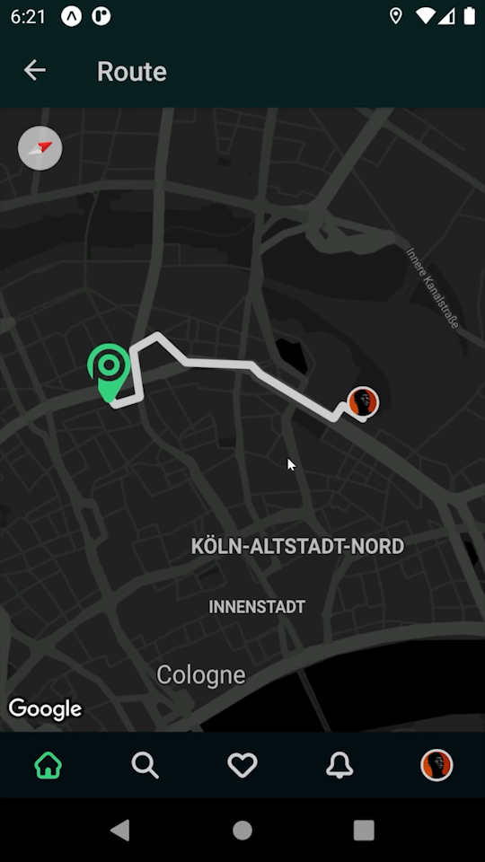
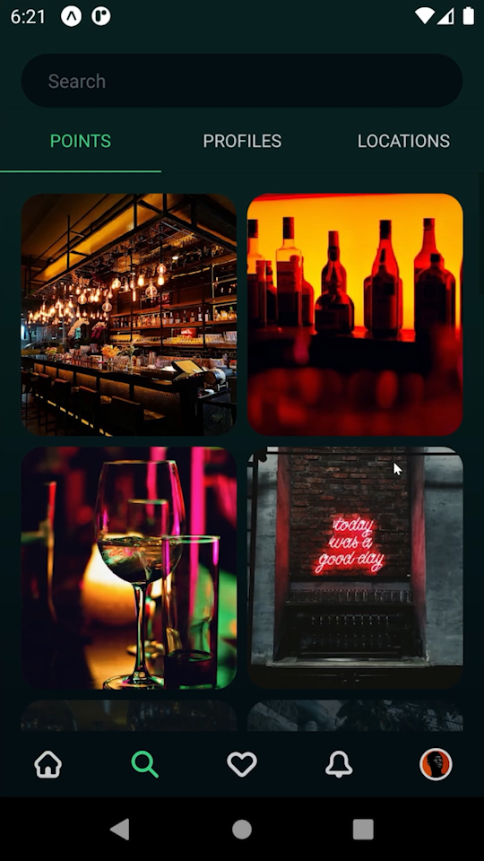
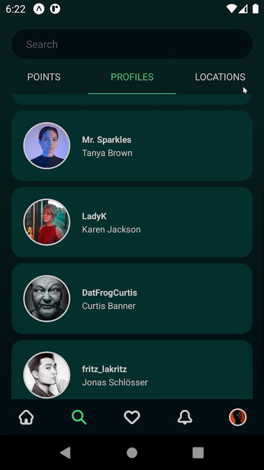
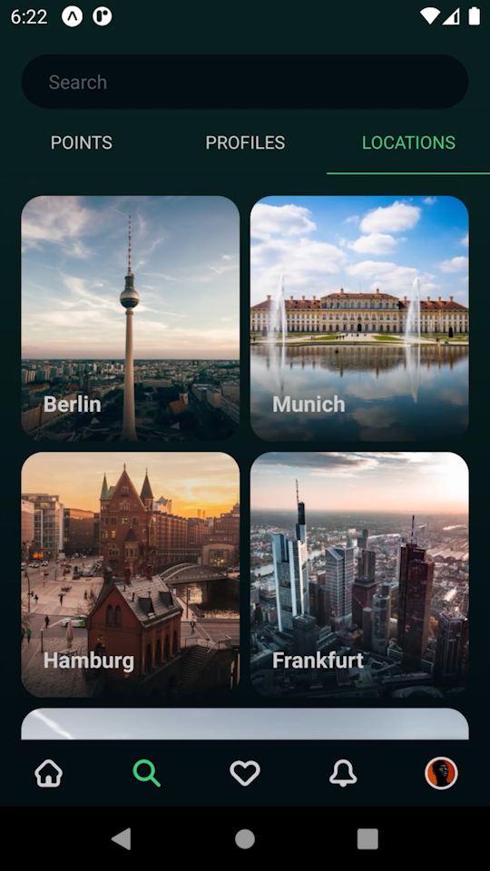

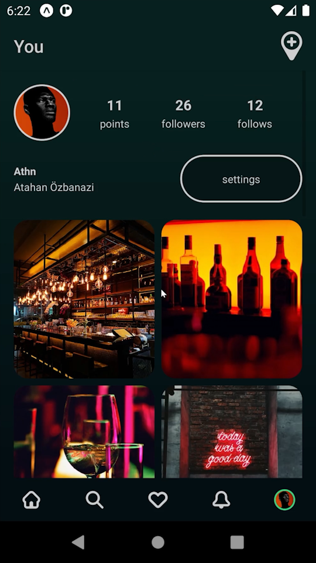
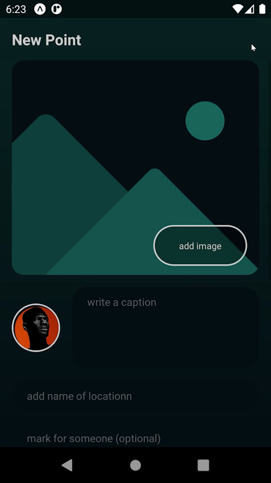
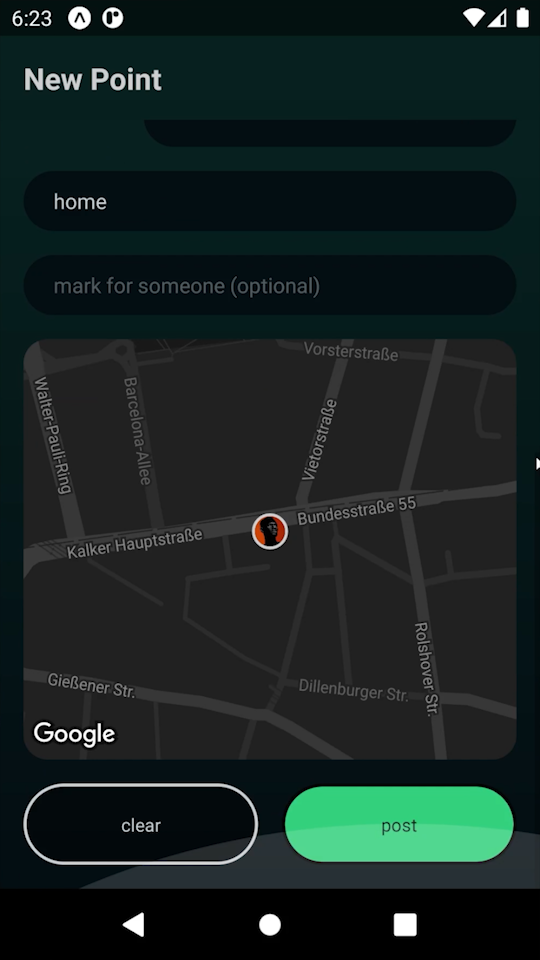
